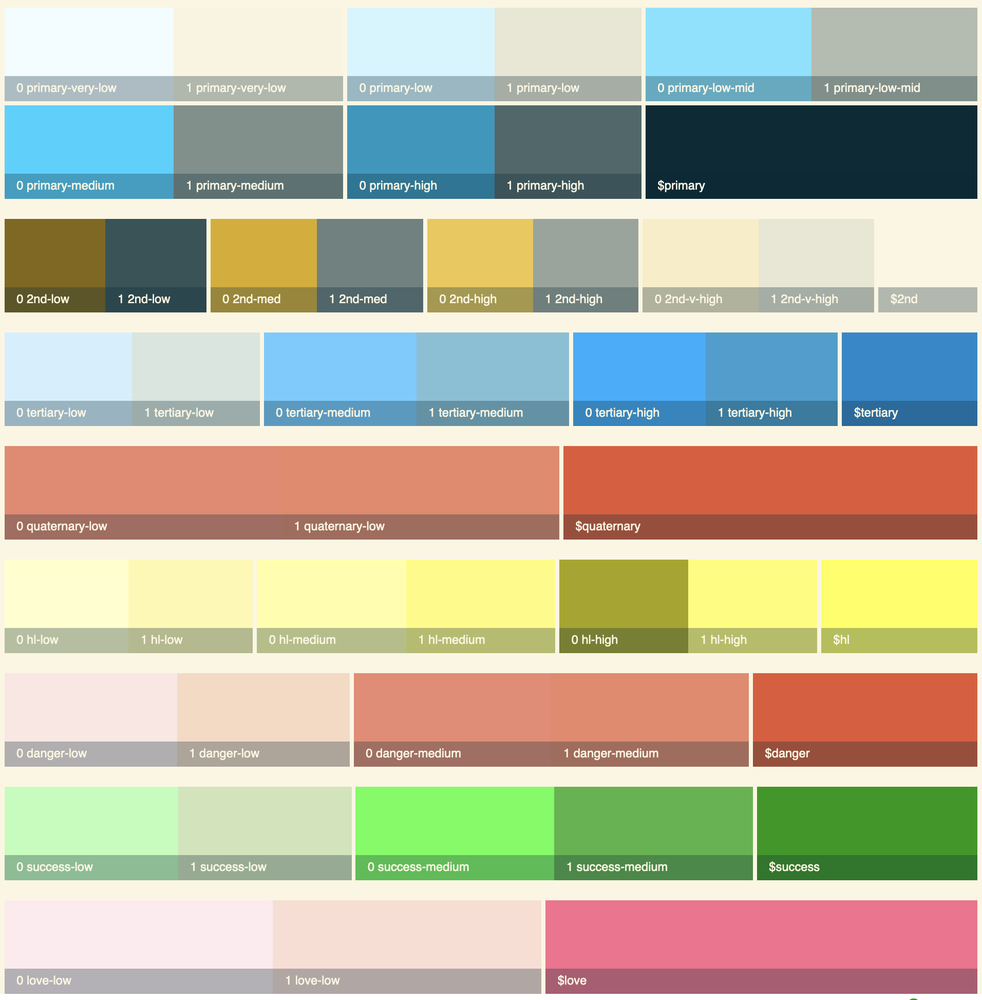

This theme is used to test the alternate color functions that generate `primary`,`secondary`, etc. colors.

To be able to use this theme, make sure your discourse instance is set to this branch: https://github.com/discourse/discourse/tree/new-css-variable-functions

The new function is located at `app/assets/stylesheets/common/foundation/variables.scss` in the Discourse app.

```scss
@function dl-test($color-1, $color-2, $lighter-than-amt, $darker-than-amt) {
  // for mix to work properly, always mix with darker color first
  // lighter color second
  @if dc-color-brightness($color-1) > dc-color-brightness($color-2) {
    // if cololor 1 is lighter than color 2, do this and use lighter-amt
    @return mix($color-2, $color-1, $lighter-than-amt);
  } @else {
    // if color 1 is darker than color 2, do this and use darker-amt
    @return mix($color-1, $color-2, $darker-than-amt);
  }
}
```

The new function works by mixing the darker of the two colors, with the lighter of the two. (I have found that the darker color needs to always come first for consitency, this is due to the way `mix()` works.)

If `color-1` is lighter than `color-2`, the `$lighter-than-amt` will be used fo the mix. If it is darker than `color-2` the `$darker-than-amt` will be used.

The new test variables are located at `app/assets/stylesheets/common/foundation/color_transformations.scss`

```scss
$test-primary-very-low: dl-test($primary, $secondary, 95, 1) !default;
$test-primary-low: dl-test($primary, $secondary, 90, 8) !default;
$test-primary-low-mid: dl-test($primary, $secondary, 52, 29) !default;
$test-primary-medium: dl-test($primary, $secondary, 40, 50) !default;
$test-primary-high: dl-test($primary, $secondary, 28, 70) !default;
$test-primary-very-high: dl-test($primary, $secondary, 50, 50) !default;
```

This theme generates a "color palette" similar to the one in the styleguide on theme creator above the Header of the site.

